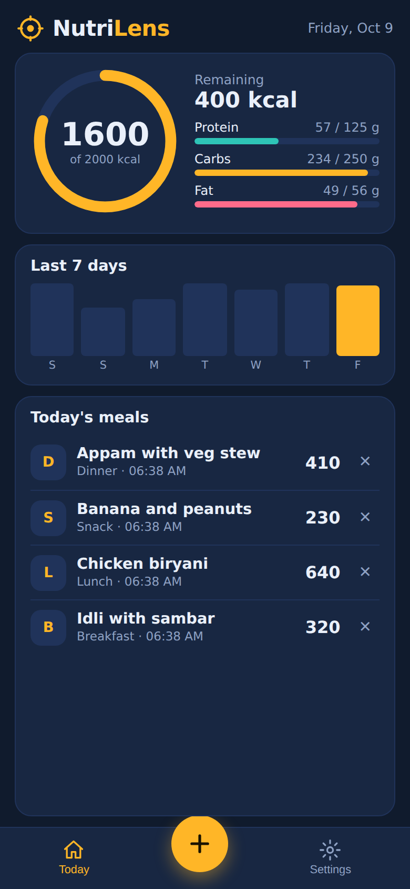
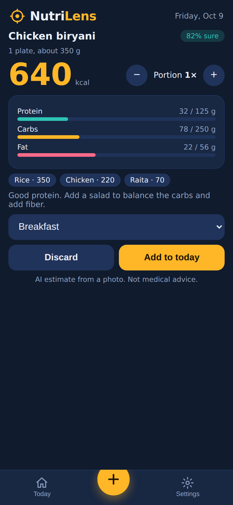
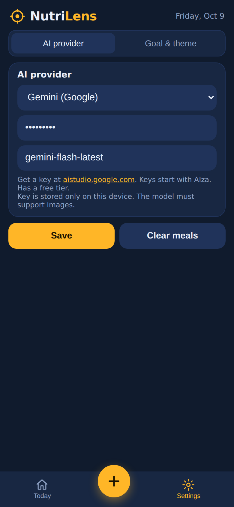
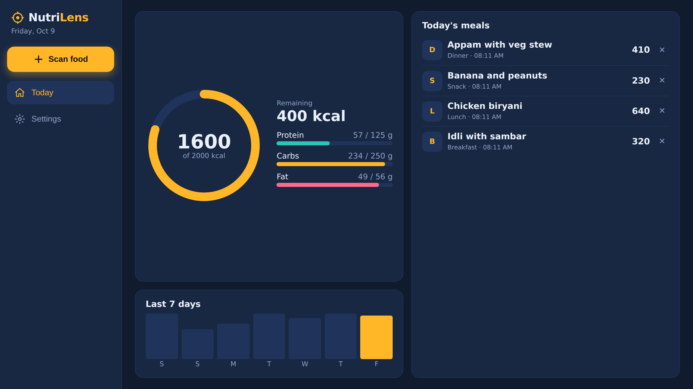
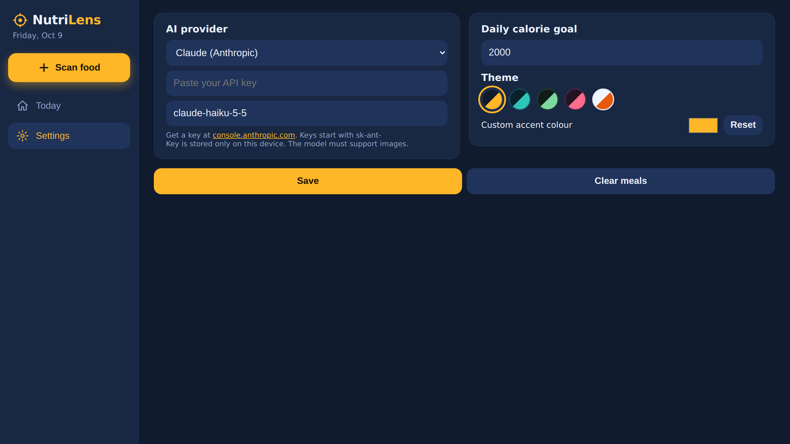
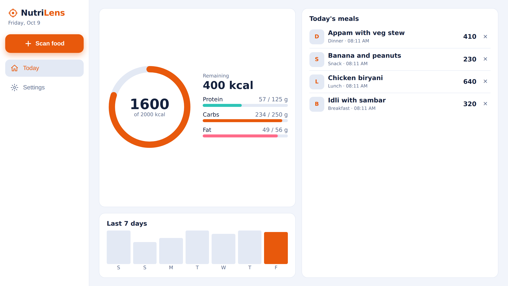

# NutriLens

**Snap a photo of your meal. Get calories, macros and a per-item breakdown in seconds.**

NutriLens is an AI food tracker built with plain HTML, CSS and JavaScript. **Bring any vision-capable AI key: Claude, ChatGPT (OpenAI), Gemini, OpenRouter, or any OpenAI-compatible service.** It installs like a native app on Android, iOS and desktop, works offline after first load, and adapts to any screen size without scrolling.

> Rebuilt from scratch after I lost the original project files. Design ideas were borrowed from popular AI calorie apps (daily dashboard, editable portions, confidence score, meal log).

| Phone | | Phone |
|---|---|---|
|  |  |  |





## Supported AI providers
| Provider | Key starts with | Default model | Get a key |
|---|---|---|---|
| Claude (Anthropic) | `sk-ant-` | `claude-haiku-5-5` | console.anthropic.com |
| ChatGPT (OpenAI) | `sk-` | `gpt-4o-mini` | platform.openai.com/api-keys |
| Gemini (Google) | `AIza` | `gemini-flash-latest` | aistudio.google.com/apikey |
| OpenRouter (hundreds of models) | `sk-or-` | `openai/gpt-4o-mini` | openrouter.ai/keys |
| Custom (Groq, Together, Ollama, LM Studio...) | any | you choose | your provider |

The app detects the provider from your key automatically. The model name is editable, because providers retire models often. **The model must support image input.** A ChatGPT or Claude chat subscription is not an API key.

## Features
- Works with Claude, ChatGPT, Gemini, OpenRouter or any OpenAI-compatible key
- Log a meal by photo or by typing what you ate
- AI estimate of calories, protein, carbs, fat, with per-item breakdown
- Confidence score on every result
- Portion stepper: change the portion and all numbers rescale
- Daily calorie ring, macro progress bars, 7-day chart, meal log
- Adjustable daily calorie goal
- 5 themes plus a custom accent colour picker
- Responsive fixed layout: phone, tablet, desktop, no page scrolling
- Installable PWA, offline shell, Android APK ready

## Try it
1. Open the live app: `https://thetechbot.github.io/nutrilens/`
2. Go to **Settings → AI provider**, paste your own API key (provider is detected automatically), tap **Save**.
3. Tap **+** (or **Scan food**), add a photo, tap **Analyze**.

Your key is saved only in your own browser. It is never in this repository.

## Install as an app
- **Android:** open the live link in Chrome, menu, **Add to Home screen**. Or download the APK from the [Releases](../../releases) page.
- **iPhone:** open the link in Safari, Share, **Add to Home Screen**.
- **Desktop:** click the install icon in the Chrome or Edge address bar.

## How it works
1. The photo is resized in the browser to 1024 px and compressed to JPEG.
2. It is sent with a short prompt directly to the AI provider you chose, asking for structured JSON (dish, calories, macros, items, confidence, tip).
3. The app validates the response, shows it, and stores your meal log in `localStorage` on your device.

No server. No account. No analytics.

## Project structure
```
index.html              the whole app (HTML, CSS, JS)
manifest.webmanifest    install metadata
sw.js                   service worker (offline shell)
icon-*.png              app icons
screenshots/            README images
```

## Known limitations
- Calorie numbers are **AI estimates from a photo**, not measurements. Not medical or dietary advice.
- The app calls the AI provider directly from the browser, so each user must bring their own API key. A production version needs a small backend to hold the key.
- Some providers block browser requests (CORS) or have no vision models. Gemini, OpenAI, Claude and OpenRouter work from the browser. If a custom provider fails, try OpenRouter.
- Model names change. If you get a "model not found" error, edit the model name in Settings.
- Meals are stored per device. No sync between devices.
- The Today list shows only the meals that fit the screen.

## Roadmap
- Backend proxy so users do not need their own key
- Barcode and nutrition-label scanning
- Full history screen and weekly insights
- Export meal log to CSV

## Tech
HTML5, CSS custom properties (theming), vanilla JavaScript, Web App Manifest, Service Worker. AI via the Anthropic, OpenAI, Google Gemini and OpenRouter APIs.

## License
MIT. See [LICENSE](LICENSE).
